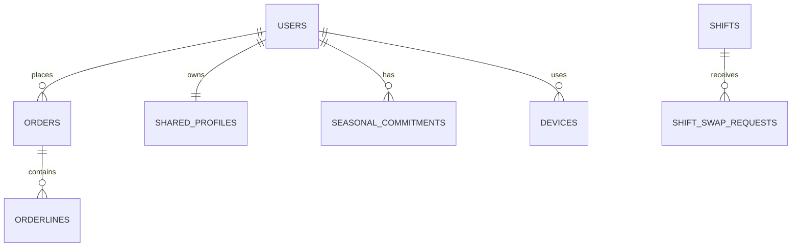

# Firestore Estructura MVP Propuesta (v1)

Fecha: 2026-03-06

Documento canonico de campos (implementacion):
- `docs-es/requirements/firestore-collections-campos-v1.md`

## 1. Objetivo

Definir una estructura Firestore para MVP que:
- Reutilice al máximo lo ya existente.
- Soporte reglas de negocio cerradas (pedidos, compromisos, turnos, roles, notificaciones).
- Permita evolución posterior sin migraciones disruptivas.

## 2. Inventario actual detectado

Colecciones detectadas en proyecto/documentación:
- `users`
- `users/*/devices` (subcoleccion)
- `products`
- `orders`
- `orderLines` (nombre legacy en dataset actual)
- `containers`
- `measures`
- `news` (actualmente vacia)

Conjuntos de campos legacy confirmados:
- `containers`: `name`, `plural`
- `measures`: `abbreviation`, `name`, `plural`, `type`
- `users` (observado): `available`, `companyName`, `email`, `isAdmin`, `isProducer`, `lastDeviceId`, `name`, `numResignations`, `phone`, `surname`, `tropical1`, `tropical2`, `typeConsumer`, `typeProducer`, mas subcoleccion `devices`
- `products` (observado): `available`, `companyName`, `container`, `description`, `name`, `price`, `quantityContainer`, `quantityWeight`, `stock`, `unity`, `urlImage`, `userId`
- `orders` (observado): `name`, `surname`, `userId`, `week`
- `orderLines` (observado): `companyName`, `orderId`, `productId`, `quantity`, `subtotal`, `userId`, `week`

Soporte operativo detectado:
- `develop/collections/config/global` y `production/collections/config/global` con:
  - `cacheExpirationMinutes`
  - `lastTimestamps`
  - `otherConfig.deliveryDayOfWeek`
  - `versions.{android,ios}.{current,min,forceUpdate,storeUrl}`

Layout de namespaces detectado:
- `<env>/collections/...` para datos actuales
- `<env>/plus-collections/...` para el nuevo modelo
- `<env>` cloud: `develop`, `production`

Campos existentes relevantes en `orderlines` (según datos reales migrados 2025):
- Núcleo: `orderId`, `userId`, `productId`, `quantity`, `subtotal`, `week`, `weekKey`, `companyName`, `vendorId`.
- Snapshot histórico: `productName`, `productImageUrl`, `priceAtOrder`, `unitName`, `unitPlural`, `unitQty`, `packContainerName`, `packContainerPlural`, `packContainerQty`, `createdAt`, `vendorId`, `weekKey`.

Conclusión: ya existe base útil para pedidos e histórico; no conviene rediseñar desde cero.

## 3. Principios de diseño para MVP

- Mantener colecciones `users`, `products`, `orders`, `orderlines`.
- Reutilizar registro de dispositivos por socio para entrega push (`users/{userId}/devices`), incluyendo el ultimo `fcmToken` conocido.
- Soportar alta preautorizada por email y enlace de UID en primer login autorizado.
- Formalizar politica remota de version en arranque y sincronizacion selectiva guiada por frescura.
- Borrado lógico para entidades históricas (productos/usuarios) en vez de borrado físico.
- Mantener snapshot del nombre visible del comprador en `orders` y `orderlines` para histórico y vistas de productor.
- Snapshot en `orderlines` para preservar trazabilidad económica de cada compra.
- Modelar la opcion de ecocesta `pickup`/`no_pickup` en la linea de pedido y no por naming libre (`Renuncia`).
- Mantener `products.productImageUrl` como fuente canonica de imagen para listados y detalle.
- Usar `users.producerCatalogEnabled` para visibilidad global del catalogo del productor y mantener `products.isAvailable` para disponibilidad por producto.
- Mantener clasificacion explicita del productor en `users` con `producerParity` (`even`|`odd`|`null`) e `isCommonPurchaseManager` (booleano), sin crear valores extra en `roles`.
- Mantener `products` ajeno a campañas concretas; la temporalidad anual o por campaña debe vivir en `seasonalCommitments` y solo pasar a una entidad propia si más adelante hiciera falta.
- Resolver calendario en modo hibrido: dia por defecto en `config/global.deliveryDayOfWeek` + excepciones semanales en `deliveryCalendar/{weekKey}`.
- Evitar sobre-normalización en MVP.
- Añadir colecciones nuevas solo donde faltan capacidades críticas.

## 4. Modelo propuesto (MVP)

## 4.1 Colecciones reutilizadas (con ampliaciones)

### `users/{userId}`

Campos base propuestos:
- `displayName` (string)
- `email` (string)
- `emailNormalized` (string, para lookup de autorización)
- `authUid` (string|null, `null` hasta primer login autorizado)
- `lastDeviceId` (string|null, ultimo dispositivo activo)
- `phone` (string, opcional)
- `roles` (array<string>): `member`, `producer`, `admin`
- `isActive` (bool)
- `producerCatalogEnabled` (bool, default `true`)
- `producerParity` (string|null): `even` | `odd` | `null`
- `isCommonPurchaseManager` (bool, default `false`)
- `ecoCommitment` (map): `{ mode: weekly|biweekly, parity: even|odd|null }`
- `settings` (map): `{ theme: light|dark|system }`
- `createdAt`, `updatedAt` (timestamp)
- `archivedAt` (timestamp|null)

Notas:
- `isActive = false` resuelve exclusión en recordatorios/auto-pedido/turnos.
- `producerCatalogEnabled` controla visibilidad global del catalogo del productor y no debe duplicarse en `settings`.
- `producerParity` e `isCommonPurchaseManager` modelan la clasificación funcional del productor sin multiplicar roles.
- Motivo de baja no obligatorio (decisión funcional).
- `lastDeviceId` referencia `users/{userId}/devices/{deviceId}` para acceso rápido al dispositivo reciente.

Subcoleccion asociada:
- `users/{userId}/devices/{deviceId}` con metadatos del dispositivo (`platform`, `appVersion`, `osVersion`, `apiLevel`, `manufacturer`, `model`, `fcmToken`, `tokenUpdatedAt`, `firstSeenAt`, `lastSeenAt`).
- Regla conocida: en iOS `apiLevel` se guarda como `null`.

### `products/{productId}`

Campos base propuestos:
- `vendorId` (string, inmutable)
- `companyName` (string)
- `name` (string)
- `description` (string)
- `productImageUrl` (string|null)
- `price` (number)
- `pricingMode` (string): `fixed` | `weight`
- `weightStep` (number|null)
- `minWeight` (number|null)
- `maxWeight` (number|null)
- `unitName`, `unitPlural`, `unitQty` (snapshot-friendly)
- `unitAbbreviation` (abreviatura para UI compacta)
- `packContainerName`, `packContainerPlural`, `packContainerQty` (snapshot-friendly)
- `packContainerAbbreviation` (abreviatura para UI compacta)
- `isAvailable` (bool)
- Visibilidad final en listado: `producerCatalogEnabled == true` + `isAvailable == true` + `archived == false`
- `stockMode` (string): `finite` | `infinite`
- `stockQty` (number|null)
- `isEcoBasket` (bool)
- `isCommonPurchase` (bool)
- `commonPurchaseType` (string|null): `seasonal` | `spot` | null
- `archived` (bool)
- `createdAt`, `updatedAt` (timestamp)

### `orders/{orderId}`

Sugerencia de id estable: `${userId}_${weekKey}` para facilitar upsert semanal.

Campos base propuestos:
- `userId` (string)
- `week` (number)
- `weekKey` (string) ejemplo: `2026-W10`
- `deliveryDate` (date/timestamp)
- `consumerStatus` (string): `sin_hacer` | `en_carrito` | `confirmado`
- `producerStatus` (string): `unread` | `read` | `prepared` | `delivered` (inicial `unread`, sin `null`)
- `total` (number)
- `totalsByVendor` (map<string, number>, clave = `vendorId`)
- `isAutoGenerated` (bool)
- `autoGeneratedReason` (string|null, traza opcional): `forgotten_commitment` | null
- `createdAt`, `updatedAt`, `confirmedAt` (timestamp|null)

### `orderlines/{orderlineId}`

Campos recomendados mínimos:
- `orderId`, `userId`, `productId`, `vendorId`
- `companyName`, `productName`, `productImageUrl`
- `quantity`, `priceAtOrder`, `subtotal`
- `pricingModeAtOrder`, `priceAtOrder`
- `unitName`, `unitAbbreviation`, `unitPlural`, `unitQty`
- `packContainerName`, `packContainerAbbreviation`, `packContainerPlural`, `packContainerQty`
- `ecoBasketOptionAtOrder`
- `week`, `weekKey`
- `createdAt`, `updatedAt`

Recomendación:
- Mantener `orderlines` como snapshot histórico autónomo, sin campos legacy de compatibilidad.

## 4.2 Colecciones nuevas (mínimas para MVP)

### `deliveryCalendar/{weekKey}`

Objetivo: modelar el día real de reparto y bloqueo semanal.

Campos:
- `weekKey` (string)
- `deliveryDate` (timestamp/date)
- `ordersBlockedDate` (timestamp/date) día siguiente a reparto
- `ordersOpenAt` (timestamp) día +2 a las 00:00
- `ordersCloseAt` (timestamp) domingo 23:59
- `updatedBy` (userId admin)
- `updatedAt` (timestamp)

Regla de uso:
- `deliveryCalendar` guarda solo semanas excepcionales y usa `weekKey` como ID de documento.
- Si falta una semana en `deliveryCalendar`, se aplica fallback a `config/global.deliveryDayOfWeek`.

### `seasonalCommitments/{commitmentId}`

Objetivo: compromisos por socio+producto+temporada.

Campos:
- `userId` (string)
- `productId` (string)
- `seasonKey` (string)
- `fixedQtyPerOfferedWeek` (number)
- `active` (bool)
- `createdAt`, `updatedAt`

### `sharedProfiles/{userId}`

Objetivo: info compartida entre socios (separada de datos de administración).

Campos:
- `userId` (string)
- `familyNames` (string)
- `photoUrl` (string|null)
- `about` (string)
- `updatedAt` (timestamp)

Nota:
- Aquí sí se admite borrado duro del contenido compartido (no del usuario).

### `shifts/{shiftId}`

Objetivo: agenda de reparto/mercado visible en app.

Campos:
- `type` (string): `delivery` | `market`
- `date` (timestamp/date)
- `assignedUserIds` (array<string>)
- `helperUserId` (string|null) para reparto
- `status` (string): `planned` | `swap_pending` | `confirmed`
- `source` (string): `app` | `google_sheets`
- `createdAt`, `updatedAt`

Notas:
- `status` describe el estado operativo del turno (`shifts`) y no el flujo de la solicitud.
- `source` indica de dónde sale ese turno (`app` si se gestiona en la app/admin o `google_sheets` por integración/sync).

### `shiftSwapRequests/{requestId}`

Objetivo: ciclo de intercambio de turnos.

Campos:
- `shiftId` (string)
- `requesterUserId` (string)
- `targetUserId` (string)
- `status` (string): `pending` | `accepted` | `requester_confirmed` | `rejected` | `cancelled` | `applied`
- `requestedAt`, `respondedAt`, `confirmedAt`, `appliedAt` (timestamp|null)

### `news/{newsId}`

Objetivo: noticias publicadas por admin (MVP).

Campos:
- `title` (string)
- `body` (string)
- `publishedBy` (userId)
- `publishedAt` (timestamp)
- `active` (bool)

### `notificationEvents/{eventId}` (opcional MVP, recomendado)

Objetivo: trazabilidad operativa mínima de envíos.

Campos:
- `title` (string)
- `body` (string)
- `type` (string): `order_reminder` | `order_auto_generated` | `shift_swap_requested` | `shift_swap_accepted` | `shift_swap_applied` | `shift_updated` | `news_published` | `admin_broadcast`
- `target` (string): `all` | `segment` | `users`
- `targetPayload` (map)
- `sentAt` (timestamp)
- `createdBy` (string): `system` | userId
- `weekKey` (string, opcional solo cuando aplique a una semana concreta)

Contrato de `targetPayload`:
- `all`: vacío o `null`
- `users`: `{ userIds: string[] }`
- `segment`: `{ segmentType, ... }` con:
  - `members_with_pending_order` (+ `weekKey`)
  - `users_with_shift` (+ `shiftId`)
  - `producers_by_vendor` (+ `vendorId`)
  - `role` (+ `role`: `member` | `producer` | `admin`)

### `config/global` por entorno (requerido para arranque/sync)

Rutas:
- ruta actual: `<env>/collections/config/global`
- ruta de rollout: `<env>/plus-collections/config/global`
- `<env>`: `develop` o `production`

Campos base:
- `cacheExpirationMinutes` (number)
- `lastTimestamps` (map por coleccion critica)
- `otherConfig.deliveryDayOfWeek` (string, formato actual tipo `WED`)
- `versions.android.current|min|forceUpdate|storeUrl`
- `versions.ios.current|min|forceUpdate|storeUrl`

Normalizacion recomendada para `plus-collections`:
- subir `deliveryDayOfWeek` a primer nivel,
- manteniendo compatibilidad de lectura con `otherConfig.deliveryDayOfWeek`.

## 5. Relaciones clave

- `users` 1..N `orders`
- `orders` 1..N `orderlines`
- `users` 1..1 `sharedProfiles`
- `users` 1..N `seasonalCommitments`
- `users` 0..1 identidad auth enlazada (`authUid`) tras primer acceso autorizado
- `users` 1..N `devices`
- `users` 0..1 puntero al ultimo dispositivo activo (`lastDeviceId`)
- `shifts` 1..N `shiftSwapRequests`

## 6. Índices recomendados

Mínimos para MVP:
- `orders`: `(userId ASC, weekKey DESC)`
- `orders`: `(weekKey ASC, consumerStatus ASC)`
- `orderlines`: `(orderId ASC, companyName ASC)`
- `orderlines`: `(vendorId ASC, weekKey DESC)`
- `products`: `(vendorId ASC, archived ASC, isAvailable ASC)`
- `users/{userId}/devices`: `(lastSeenAt DESC)` (si se consulta historial por recencia)
- `shifts`: `(date ASC, type ASC)`
- `shiftSwapRequests`: `(targetUserId ASC, status ASC, requestedAt DESC)`
- `seasonalCommitments`: `(userId ASC, seasonKey ASC, active ASC)`

## 7. Reglas de seguridad (resumen)

- `users`:
  - lectura propia y pública mínima según rol.
  - escritura administrativa solo admin.
  - primer login autorizado puede enlazar `authUid` bajo reglas controladas.
  - `lastDeviceId` debe mantenerse consistente con la subcoleccion de dispositivos.
- `users/{userId}/devices`:
  - escritura por usuario autenticado propietario y/o backend, incluyendo refresco de token.
  - lectura de soporte por admin.
- `config/global`:
  - lectura para cliente autenticado.
  - escritura restringida a admin/sistema.
- `sharedProfiles`:
  - lectura para socios autenticados.
  - escritura solo propietario (`request.auth.uid == userId`).
- `products`:
  - escritura por productor propietario o admin.
  - prohibir cambio de `vendorId` en updates.
- `orders`/`orderlines`:
  - socio solo sus pedidos.
  - productor acceso a agregados vinculados a sus productos.
  - admin acceso de soporte.
- `news`:
  - escritura solo admin.
- `shifts`/`shiftSwapRequests`:
  - lectura para socios.
  - creación de solicitudes por socios implicados.
  - aplicación final controlada por reglas de estado + función backend.
- si un usuario autenticado no tiene email preautorizado en `users`, queda en modo restringido sin acciones operativas.

## 8. Estrategia de migración incremental

Fase 1 (sin ruptura):
- Mantener colecciones actuales y añadir solo campos nuevos opcionales (`stockMode`, `emailNormalized`, `authUid`, `lastDeviceId`, `producerParity`, `isCommonPurchaseManager`, `unitAbbreviation`, `packContainerAbbreviation`, etc.).
- Mantener y normalizar `users/{userId}/devices/{deviceId}` como fuente canonica de metadatos de dispositivo.
- Mantener/alinear contrato `config/global` por entorno con campos actuales (`cacheExpirationMinutes`, `lastTimestamps`, `otherConfig.deliveryDayOfWeek`, `versions.{android,ios}.{current,min,forceUpdate,storeUrl}`).

Fase 2 (capacidad nueva):
- Introducir `deliveryCalendar`, `seasonalCommitments`, `sharedProfiles`, `shifts`, `shiftSwapRequests`, `news`.
- Añadir validaciones de compromisos por backend/cliente.
- Incluir `no_pickup` como opcion valida y pagada en la linea de pedido de ecocesta.
- Forzar precio unico de ecocesta entre productores par/impar y opciones `pickup`/`no_pickup`.

Fase 3 (automatismos):
- Recordatorios push dominicales (20:00, 22:00, 23:00 Europe/Madrid).
- Auto-creación opcional de pedido mínimo por olvido (excluyendo socios con `isActive = false`).
- Enrutado de usuario revisor a `develop` mediante allowlist.

Fase 4 (extension de catalogo post-MVP):
- Habilitar productos a granel con `pricingMode = weight`.
- Guardar snapshot en `orderlines` para granel (`pricingModeAtOrder`, `priceAtOrder`, `quantity` en unidad de peso del producto).

## 9. Compatibilidad con lo ya hecho

Aprovechamiento directo:
- Se conserva la base actual de `orders` y `orderlines` (incluyendo migración 2025).
- Se conservan `products` y `users` ampliando campos, no reemplazando entidad.
- Se conserva `users/{userId}/devices` y se formaliza en el contrato MVP.
- Se mantiene esquema de timestamps por colección en `config/global`.

Cambios mínimos requeridos:
- Añadir nuevas colecciones solo para capacidades no cubiertas hoy.
- Añadir índices y reglas Firestore alineadas con roles.

## 10. Riesgos técnicos a vigilar

- Complejidad de permisos de productor sobre agregados sin exponer datos de otros productores.
- Sincronización con Google Sheets para turnos (conflictos de escritura concurrente).
- Diferenciación robusta de entorno para usuario revisor en app productiva.
- Consistencia de recordatorios en iOS/Android cuando la app no está activa.
- Frescura de metadatos de dispositivos y punteros `lastDeviceId` obsoletos.
- Consistencia de redondeo decimal en calculos de granel (`quantity * price`) entre Android, iOS y backend.
